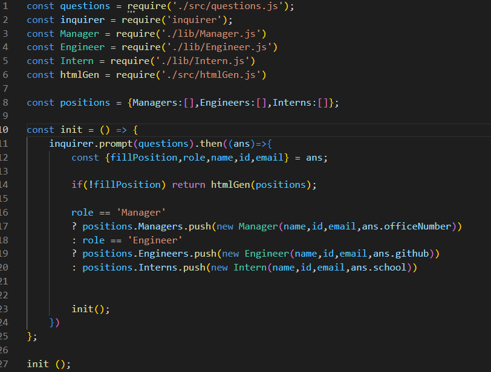
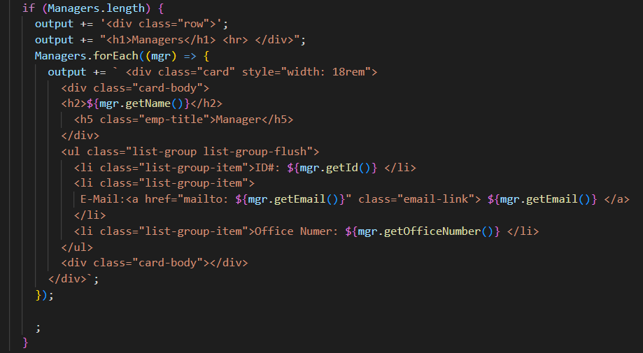
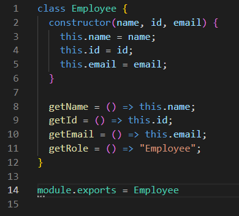
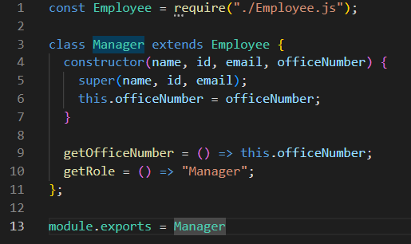
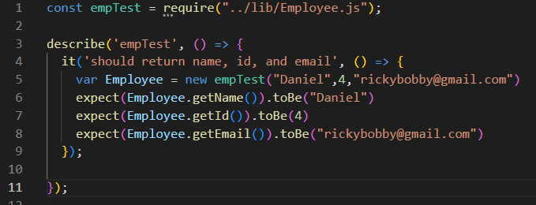
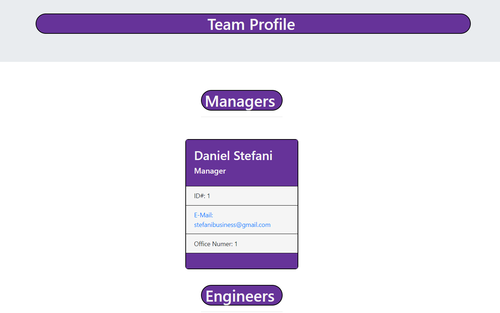

# TeamProfileGenerator

## Description
This is application to generate a list of profiles for a small work team. All the e-mail addresses and GitHub links are clickable. Each role for the company features different content for the employee profile card. You may view this at the [Deployed](https://github.com/DStefani86/TeamProfileGenerator).

## Table of Contents

[Installation](#installation)

[Usage](#usage)

[License](#license)

[Contributors](#contributions)

[Tests](#tests)

[Questions](#questions)

## Installation
Visit my GitHub repository featured in the Questions section below. Find the TeamProfileGenerator repository. Clone the SSH down from my the repository into your own terminal and enjoy! Node must be installed to use this application and you must be within the file path that contains 'index.js'. After you have gone through the installation process, run the 'node index.js' command in your terminal. A series of prompts will appear.

## Usage

I am including some examples of my code to demonstrate the functionality of my application. I first wanted to showcase the simplicity of my javascript index file. Only running one function to initialize the inquirer prompts. 

Next is an example from my htmlGen page where I did all the html I wanted to be displayed based on the users inputs of the inquirer prompts. The questions/answers change based on the role the user is inputting for.

Made a class for each role that stemmed from the employee class that gets the same questions no matter what role is selected.

I then made roles with more specific questions based on the employee role using the constructor/super commands.

I also included an example of one of my test functions. 

Finally, it leaves us with a clean and easy to read list of employee broken down into roles on the team.html in the dist foler.

If you have any other curiosities about the functionality of this application please watch the tutorial video I have included

[Video](./assets/images/videoexample.mp4)

There is a [SAMPLE](SAMPLE.html) of the work generated in the repository

## License 
This application is licensed by MIT

## Contributions
The Studious Studiers Discord!!

## Tests
Featured 4 tests for each class and employee role. Employee, Manager, Engineer, and Intern.

## Questions
You can reach me at stefanibusiness@gmail.com or via GitHub [DStefani86](https://github.com/DStefani86)
